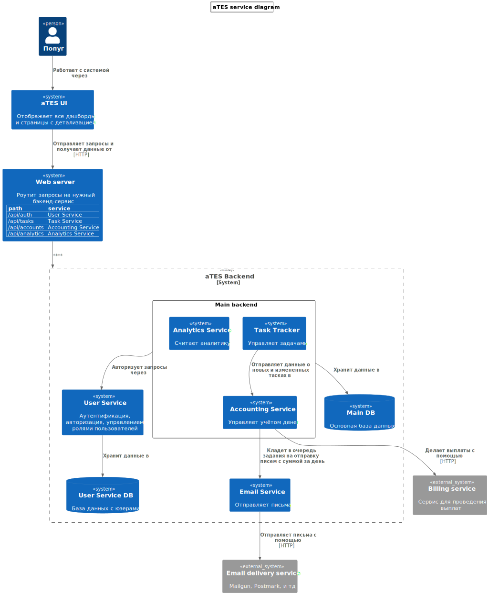

# Awesome Task Exchange System 



### Описание сервисов

**UI**

- Пользовательский интерфейс PopugJira (aka aTES)

**Web Server**

- Единая точка входа для всех запросов от клиентов
- Роутит запросы на нужный бэкенд-сервис

**User Service**

- Отвечает за аутентификацию, авторизацию и управление ролями для пользователей
- По запросу отдаёт роли пользователя в системе
- Хранит данные в отдельной User Service DB

```
User {
  roles
}
```

**Task Tracker**

- CRUD-сервис для тасок в таск-трекере
- Отправляет в Accounting Service данные обо всех новых и измененных тасках
- Отдаёт данные для интерфейса таск-трекера — дэшборд и списки задач по каждому попугу

```
Task {
  user_id
  status
  description
  assign_price
  done_price
}
```

**Accounting Service**

- Занимается учётом денег и выплат
- Отдаёт данные для дэшборда аккаунтинга и данные о счетах отдельных попугов
- Раз в день считает выплаты, делает выплаты и добавляет письма в очередь Email Service
- Для выплат использует внешний сервис

```
Transaction {
  account_id
  task_id
  price
}
Balance {
  account_id
  amount
}
Account {
  user_id
}
```

**Analytics Service**

- Отвечает за расчёт аналитики по системе
- Отдаёт данные для дэшбордов статистики
- Деплоится отдельно от Task Tracker и Accounting Service (тк у них разные паттерны использования БД)

**Email Service**

- Небольшой сервис-воркер, который принимает задачи на отправку писем через очередь задач
- Внутри сервиса логика составления шаблонов писем
- Если для писем нужны данные пользователя, может сходить за ними в User Service


### Потенциальные проблемы с данными

- Проблема: в момент создания/реассайна задачи Accounting Service не доступен
  - не создастся транзакция и в итоге балансы будут неверно посчитаны
  - Решение: привязывать транзакции к задачам, при подсчете сумм выплат проверять что у всех задач правильное число транзакций
  - Решение: отслеживать на стороне таск-трекера статус формирования транзакции
- Проблема: запросы Analytics Service будут (или станут) слишком тяжелыми 
  - аналитические запросы начнут мешать работе с БД других сервисов, из-за чего деградирует система в целом
  - Решение: отдельная read-реплика БД для аналитики